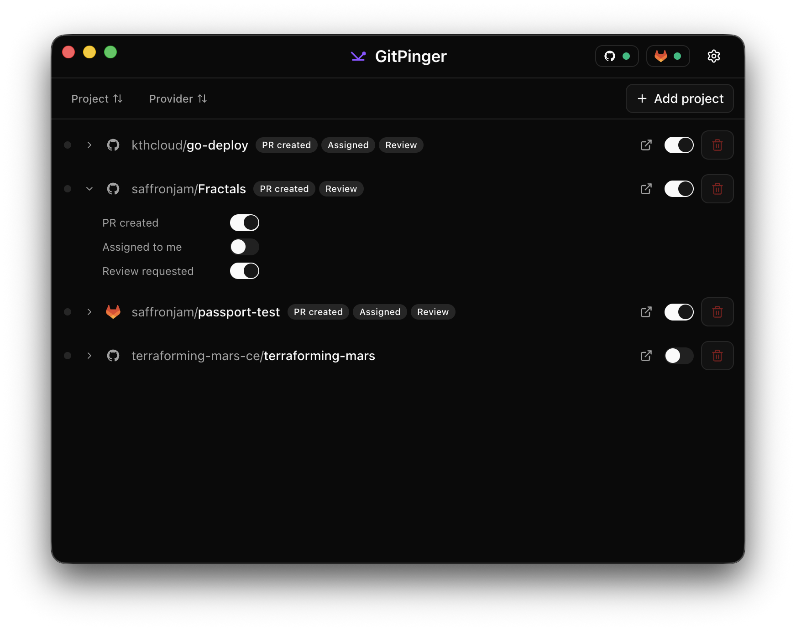

<p align="center">
  
</p>

<h1 align="center">GitPinger</h1>

<p align="center">
  GitHub & GitLab notifications on your desktop. Available on macOS and Linux.
</p>

<p align="center">
  <a href="https://github.com/saffronjam/git-pinger/actions/workflows/ci.yml"></a>
  <a href="https://github.com/saffronjam/git-pinger/releases"></a>
  <a href="LICENSE"></a>
</p>

<p align="center">
  
</p>

## Features

- **GitHub + GitLab** — monitor PRs and MRs across both platforms in one app
- **Native notifications** — get pinged when you're assigned, review-requested, or a PR updates
- **Per-project control** — choose exactly which repos and events you care about
- **OAuth & PAT auth** — Device Flow for github.com and gitlab.com, Personal Access Tokens for self-hosted GitLab
- **Lightweight** — lives in your system tray, polls on a configurable interval

## Download

Grab the latest release for your platform:

| Platform | Download                                                                                                                                     |
| -------- | -------------------------------------------------------------------------------------------------------------------------------------------- |
| macOS    | [`.dmg`](https://github.com/saffronjam/git-pinger/releases/latest)                                                                           |
| Linux    | [`.AppImage`](https://github.com/saffronjam/git-pinger/releases/latest) / [`.deb`](https://github.com/saffronjam/git-pinger/releases/latest) |

## Development

```bash
bun install
bun run dev
```

See [`CLAUDE.md`](CLAUDE.md) for architecture details and the full command reference.

## License

[MIT](LICENSE)
